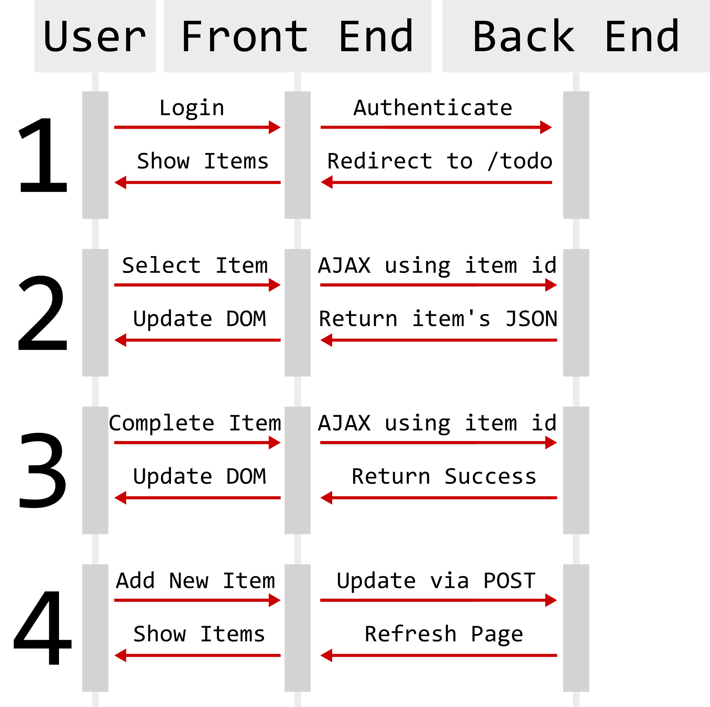

# todo_django
Simple Todo App (NOW LIVE!: http://todo-dj.herokuapp.com/todo/ )

# Intro:
My name is Noah - I'm an aspiring developer and this is one of my side projects. This readme document will cover why I built this, how I built this, and what I accomplished & learned. 

Although I am purusing a CS degree, experience seems to be far, far more important. In fact, if the statitstic is accurate, half of developers don't even have a degree! (https://thenextweb.com/insider/2016/04/23/dont-need-go-college-anymore-programmer/#.tnw_nd16W1fm) While I am learning a ton of things in my program, I want to supplement it with my own projects. 

I believe in my ability to learn, build and achieve and I hope to use my side projects as a way to show that. 

# So why a TODO app? 
Although the business logic is pretty straight forward, I saw it as a great opportunity to learn front-end skills. This includes:
* Building a responsive(-ish) site using Bootstrap.
* Designing clean, stylish designs using CSS & Bootstrap
* Using AJAX requests to update content on the page
* Adding animations via CSS Transitions & jQuery code

Although at the outset I didn't know much of the above, I did know there were a ton of resources to help me in implementing the features & feel I wanted. Django, HTML/CSS/JS & jQuery all have big communities, enabling me to learn and build quicker. 

# How does it work?

#### Back-end
The Back-end code is nothing too special. If you are familair with Django apps, then this section will cover nothing new.  

The Back-end is built using Python & Python Django using a Postgres database. Django has a lot of neat utilities that make web-app development easy. The database structure is defined in the models.py file, which lays out what fields each todo item has. (e.g. Title, Description, Due Date, etc.). This is then migrated to the database via Django's manage.py file. 

Routing is handled by the urls.py file. When a user navigates to a specific url, Django uses the urls.py file to execute the appropriate code and either load a page, update a page, or update something in the database. 

The afromentioned actions are defined in the views.py file. Django has a lot of code readily avalible, so serving an HTML page is straightforward. views.py also handles any requests to the database, such as completing an item after clicking the checkbox. 

HTML files are held the templates folder. Django has templating capabilities and can generate the HTML file to have the appropriate data. 

Static files, such as CSS, JS, Libraries and Images, are stored in the static folder. During deployment, this is collected into a single location with static assets for other applications (such as admin-panel)

#### Front-end

# What did I accomplish & learn?
